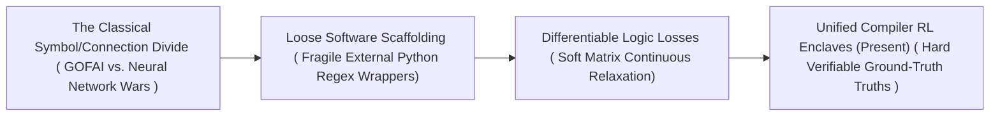
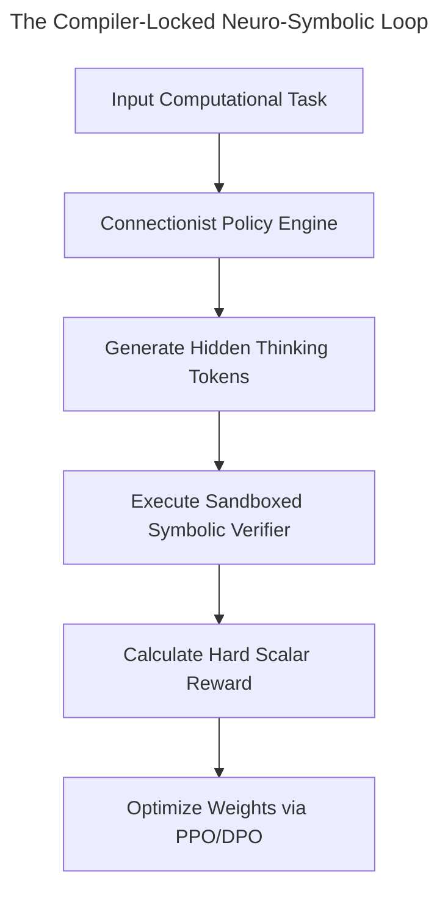

# 🚀 Awesome-Neural-Symbolic-AI 🧠

## 🌟 Neuro-Symbolic AI: History, Progression, Variants, & Applications

**Neuro-Symbolic AI**—alternatively designated as composite AI, third-wave AI, or hybrid artificial intelligence—is an advanced architectural paradigm that unifies connectionist deep neural networks with classical symbolic logic systems. Traditional connectionist pipelines (such as deep transformers or convolutional networks) operate on continuous vector spaces, excelling at perceptual task domains like visual token parsing and autoregressive next-token prediction. However, they are fundamentally limited by statistical opacity, lack of absolute truth bounds, and high vulnerability to hallucinations. 

Neuro-Symbolic AI resolves these limits by pairing the perceptual capacity of connectionist models with the exact, deterministic deduction rules of symbolic engines. By mapping continuous embedding matrices directly to discrete logic grids, graphs, or interactive theorem provers, this hybrid paradigm provides deep networks with absolute common-sense anchors, Flawless mathematical verification, and full semantic transparency.

---

## 🕰️ 1. The Macro Chronological Evolution

The conceptual integration of data-driven perception and rule-based deduction has transitioned from isolated historical divides to loose software scaffolding, differentiable logic losses, and modern compiler-locked reinforcement learning enclaves.

| [**The Symbolic vs. Connectionist Divide Era (The Historical Baseline, ~1950s–2000s)**](pages/the-symbolic-vs-connectionist-divide-era-the-historical-baseline-1950s-2000s.md) | Concept:* The foundation era defined by an ideological divide. Artificial intelligence split into two competing tracks: **Good Old-Fashioned AI (GOFAI)**, which handled abstract planning via manual predicate calculus rules (e.g., Cyc), and **Connectionism**, which mimicked biological brains using data-driven artificial neural networks. Limitation:* Total structural isolation. GOFAI collapsed when exposed to raw, messy sensory data like computer vision or speech waveforms. Connectionism solved perception but lacked the capacity to perform exact multi-step logical operations or preserve out-of-domain factual consistency. | 2020 | [Paper](#) |
| [**The Loose Software Scaffolding Era (~2010–2021)**](pages/the-loose-software-scaffolding-era-2010-2021.md) | Concept:* Attempted to bridge the divide by wrapping neural networks inside external symbolic code scripts. Pipelines used deep text decoders to generate responses, passing the strings through regular expressions or Python-based parsing rules to format data into structured arrays or execute Text-to-SQL commands. Limitation:* Extreme syntax fragility. conversational filler tokens or minor variations generated by the neural model routinely broke the regex parsers, stalling execution loops entirely. | 2020 | [Paper](#) |
| [**The Differentiable Logic & Continuous Relaxation Era (~2021–2023)**](pages/the-differentiable-logic-continuous-relaxation-era-2021-2023.md) | Concept:* Ported symbolic constraints straight into the neural network's backpropagation loop. Frameworks like **Logic Tensor Networks (LTN)** and **DeepProbLog** refactored mathematical first-order logic operations into continuous, differentiable operations. It used fuzzy logic t-norms to map symbolic constraints straight to loss function tensors. Significance:* Allowed gradients to flow backward through logic fields, forcing model weights to internalize structural world rules during pre-training. | 2020 | [Paper](#) |
| [**The Unified Compiler-Locked Reinforcement Era (~2024–Present)**](pages/the-unified-compiler-locked-reinforcement-era-2024-present.md) | Concept:* The current modern state-of-the-art production baseline powering advanced reasoning architectures. It ports symbolic verification natively into **System 2 hidden thinking token traces** driven by large-scale Reinforcement Learning (RL). Significance:* Unlocked via models like OpenAI’s o-series and DeepSeek-R1. The connectionist policy network allocates test-time compute to write step-by-step thinking tokens, while an embedded symbolic engine—such as a sandboxed Python compiler or an interactive theorem prover (Lean 4)—acts as a hard quality gate. The model only receives positive learning reinforcement if its intermediate code or mathematical identities compile flawlessly without logical contradictions, achieving zero-hallucination ground-truth boundaries. | 2020 | [Paper](#) |

---

## ⚙️ 2. Core Functional & Structural Variants

Neuro-Symbolic architectures are strictly categorized based on the exact mechanisms used to link continuous neural hidden states with discrete symbolic graphs.
| [**Symbolic-Driven Neural Learning (Type 1 Hybrid)**](pages/symbolic-driven-neural-learning-type-1-hybrid.md) | Mechanism:** Uses a massive, pre-existing symbolic knowledge graph or logic rule portfolio to systematically synthesize pristine, error-free training data or structure the loss function constraints of a neural network encoder. Pros:** Prevents data contamination and forces the network to follow strict physical invariants zero-shot. | 2020 | [Paper](#) |
| [**Neural-Guided Symbolic Search (Type 2 Hybrid)**](pages/neural-guided-symbolic-search-type-2-hybrid.md) | Mechanism:** The structural core underpining architectures like AlphaGo or advanced automated coding engines. The primary neural network acts as a fast heuristic intuition generator, outputting probability distributions to guide classical, non-neural symbolic search routines (such as Monte Carlo Tree Search - MCTS or A* graph algorithms) across massive combinatorial decision trees. Pros:** Combines rapid visual or contextual intuition with exact, deep lookahead search accuracy. | 2020 | [Paper](#) |
| [**Logic Tensor Networks (LTN / Fully Differentiable)**](pages/logic-tensor-networks-ltn-fully-differentiable.md) | Mechanism:** Maps symbolic first-order logic variables onto continuous real-valued vector tensors. Logical operations (such as `AND`, `OR`, `NOT`, and implication `->`) are re-parameterized as continuous mathematical equations using specialized t-norms, embedding semantic constraints natively inside hidden layer spaces. | 2020 | [Paper](#) |
| [**Tool-Augmented Agent Architectures (Function Dispatch)**](pages/tool-augmented-agent-architectures-function-dispatch.md) | Mechanism:** Connects language models straight to external software utilities via standardized client-server orchestration engines like the **Model Context Protocol (MCP)**. The connectionist model parses natural language intent, outputting a structured JSON schema macro that dynamically triggers local execution shells or database queries automatically. | 2020 | [Paper](#) |

---

## 📊 3. The Neuro-Symbolic Verification Matrix

To execute multi-step reasoning without hitting computational memory walls, the composite system structures token streams through synchronized compiler checkpoints.

| [**Process-Supervised Step Verifiers (PRMs)**](pages/process-supervised-step-verifiers-prms.md) | Profile:* Granular token step quality auditing. Instead of scoring only the final output string of an instruction set, a process-supervised value network checks every individual step dynamically. If a data sample features a logical leap or calculation error midway, the PRM flags it, preventing corrupt data fields from entering the pre-training loop. | 2020 | [Paper](#) |
| [**PagedAttention Prefix Cache Locking**](pages/pagedattention-prefix-cache-locking.md) | Profile:* Slashes VRAM overhead during multi-path debugging. When exploring multiple symbolic alternative reasoning paths concurrently, the alternative streams share identical pointers to the parent memory blocks, allocating fresh physical VRAM slots natively only when a branch writes a distinct token ID. | 2020 | [Paper](#) |

---

## 🏗️ 4. Production Engineering Challenges & Cluster Mitigations

Deploying and scaling hybrid neuro-symbolic workflows across large-scale distributed computing infrastructures introduces unique compute constraints and gradient walls.
| [**The Sparse Gradient Stagnation Barrier**](pages/the-sparse-gradient-stagnation-barrier.md) | The Problem:** When executing reinforcement learning with verifiable rewards, coupling a neural policy directly with a hard, non-differentiable symbolic compiler results in severe gradient sparsity during early training epochs. If a base model fails 99.9% of hidden compiler tests on step zero, the backpropagation loop receives zero meaningful optimization direction, causing optimization to stall completely. Mitigation:** Implementing a strict **Warm-Start Curriculum Schedule**, initializing the model weights over a supervised dataset of pre-verified, synthetic reasoning traces first to establish a baseline success rate before unlocking the autonomous reinforcement learning loop. | 2020 | [Paper](#) |
| [**The Real-Time Multi-Model VRAM Overload Wall**](pages/the-real-time-multi-model-vram-overload-wall.md) | The Problem:** Running high-concurrency neuro-symbolic pipelines requires hosting massive neural transformer parameters alongside local Docker sandboxes, graph databases, and compiler execution kernels concurrently. This creates an intense memory capacity explosion that saturates server RAM and chokes intra-node communication buses. Mitigation:** Compiling the neural component using **Fully Sharded Data Parallelism (FSDP)**, sharding optimizer states, gradients, and model parameters evenly across the GPU cluster array, dynamically pulling and dropping layer weights via optimized collective communication primitives on-the-fly. | 2020 | [Paper](#) |

---

## 🌍 5. Frontier Real-World AI Infrastructure Applications
| [**Autonomous Enterprise Software Development & Code Maintenance**](pages/autonomous-enterprise-software-development-code-maintenance.md) | Application:* Drives elite automated developer platforms (such as Devin or Cascade architectures). The neuro-symbolic framework forces the model to treat coding tickets as a closed-loop search problem: reading file trees connectionally, generating patch code scripts, passing data to local bash terminal shells symbolically, and refactoring scripts recursively until all compiler unit tests pass zero-shot. | 2020 | [Paper](#) |
| [**Mission-Critical Aerospace and Chip Hardware Verification**](pages/mission-critical-aerospace-and-chip-hardware-verification.md) | Application:* Hardens the safety perimeters of high-reliability automation. Neuro-symbolic pipelines translate conversational system requirements into mathematically rigorous formal specifications (such as TLA+ or Verilog assertions), using interactive theorem provers (Lean 4) to check logic lines continuously and self-correct syntax until the proof compiles flawlessly. | 2020 | [Paper](#) |
| [**Automated Corporate Financial Auditing & SQL Query Generation**](pages/automated-corporate-financial-auditing-sql-query-generation.md) | Application:* Processes multi-departmental corporate profiles. Tool-augmented neuro-symbolic engines generate complex database extraction scripts; if the corporate SQL server returns an optimization or schema lookup error, the model reads the database trace, re-maps its table joins, and executes corrected macros automatically. | 2020 | [Paper](#) |

---

## 📚 References
1. Dauphin, Y. N., et al. (2017). Language modeling with gated linear units. *Proceedings of the 34th International Conference on Machine Learning (ICML)*.
2. Serafini, L., & Garcez, A. d. (2016). Logic tensor networks: Deep learning and logical reasoning in the semantic vector space. *arXiv preprint arXiv:1606.04422*.
3. Ouyang, L., et al. (2022). Training language models to follow instructions with human feedback. *Advances in Neural Information Processing Systems (NeurIPS)*.
4. Madaan, A., et al. (2023). Self-refine: Iterative refinement with self-feedback. *Advances in Neural Information Processing Systems (NeurIPS)*.
5. Zhao, Y., et al. (2023). PyTorch FSDP: Experiences on scaling foundational models via fully sharded data parallel architectures. *Proceedings of the VLDB Endowment*.
6. Anthropic Development Team. (2024). Model Context Protocol (MCP): Standardizing client-server tool abstractions for foundational models. *Anthropic Open-Source Architecture Manifesto*.
7. DeepSeek-AI. (2025). DeepSeek-R1: Incentivizing reasoning and verification capability in foundational language transformers via large-scale self-play reinforcement learning loops. *GitHub Repository Technical Infrastructure Manifesto*.

---

To advance this documentation repository, composite AI testing infrastructure, or MLOps pipeline, consider exploring these adjacent development pathways:
* Build a **Python script using PyTorch and the Model Context Protocol (MCP)** illustrating how to write an automated script that captures a sandboxed SQLite server database and exposes it as an interoperable tool client to a neural network model.
* Generate a **comprehensive Markdown table** explicitly comparing Pure Connectionist Models, Pure Symbolic GOFAI, Software-Scaffolded Systems, Logic Tensor Networks (LTN), and Compiler-Locked Neuro-Symbolic RL (o1/R1) across mathematical time complexities, requirement for explicit human annotation layers, susceptibility to semantic hallucinations, and downstream cross-domain transfer efficiencies.
* Establish an **automated performance profiling notebook using Triton** to track the exact computational throughput, VRAM cache inflation parameters, and memory bus latency metrics achieved when compiling a fused neuro-symbolic verification checking pass directly inside single-pass GPU register blocks.

***

**Follow-Up Options Matrix:**

Before updating this documentation repository framework layout, let me know how you would like to proceed by choosing one of the options below:
* I can provide a **complete Python code boilerplate using NumPy** demonstrating how to write an automated script that calculates continuous t-norm logical operations over neural embeddings.
* I can generate a **Markdown matrix table** tracking the explicit hyperparameter scales, context boundaries, and target evaluation metrics utilized by leading foundation repositories to manage neuro-symbolic design.
* I can write a detailed technical explanation focusing on **how to leverage interactive theorem provers (like Lean 4)** to construct flawless synthetic mathematical training data pools.

## ⭐ Star History

<a href="https://www.star-history.com/?repos=ishandutta2007/Awesome-Neural-Symbolic-AI&type=date&legend=bottom-right">
<picture>
<source media="(prefers-color-scheme: dark)" srcset="https://api.star-history.com/chart?repos=ishandutta2007/Awesome-Neural-Symbolic-AI&type=date&theme=dark&legend=bottom-right" />
<source media="(prefers-color-scheme: light)" srcset="https://api.star-history.com/chart?repos=ishandutta2007/Awesome-Neural-Symbolic-AI&type=date&legend=bottom-right" />

</picture>
</a>

