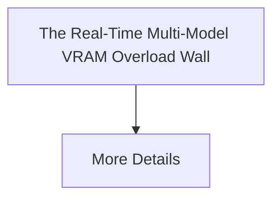

# The Real-Time Multi-Model VRAM Overload Wall

This page contains detailed information about The Real-Time Multi-Model VRAM Overload Wall.

```mermaid
flowchart TD
    A[The Real-Time Multi-Model VRAM Overload Wall] --> B[More Details]
```

[Back to README](../README.md)
